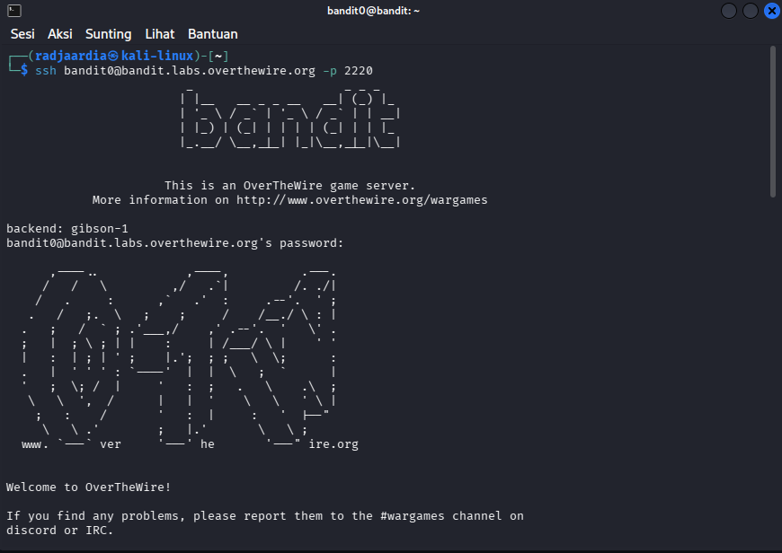

# OverThewire Bandit - Level 0

## Objective
Login ke Server Bandit menggunakan SSH dengan kredensial yang diberikan

## Solution
Membuka Command Prompt dan mengetik command : 

```bash
ssh bandit0@bandit.labs.overthewire.org -p 2220```
Password: bandit0



## Conclusion
Jadi di level ini kita diminta untuk menghubungkan ke server Bandit melalui SSH dengan kredensial yang sudah diberikan 
