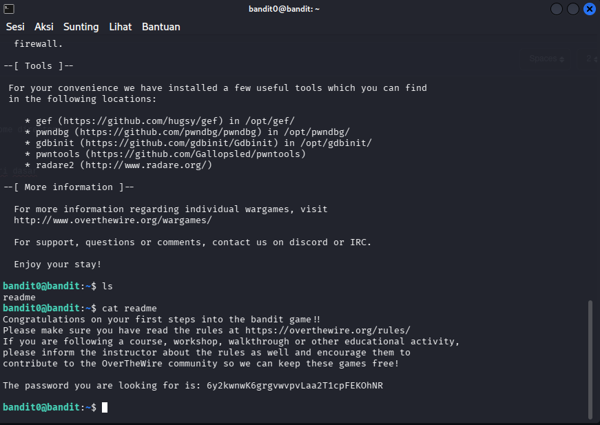

# OverTheWire : Level 0 - 1

## Objective 
Menemukan password untuk level berikutnya di file bernama "readme" di home directory

## Purpose
Mempelajari dan menggunakan command "ls","cat" sebagai navigasi direktori dasar

## Solution
``` bash
# Login
ssh bandit0@bandit.labs.overthewire.org -p 2220
Password : bandit0
```
``` bash
# Lihat Isi Directory
ls
```
``` bash
# Membaca Folder readme
cat readme
```


Password level berikutnya adalah : 6y2kwnwK6grgvwvpvLaa2T1cpFEKOhNR

## Conclusion
Kita diminta untuk mencari password level berikutnya di file bernama "readme" di home directory


