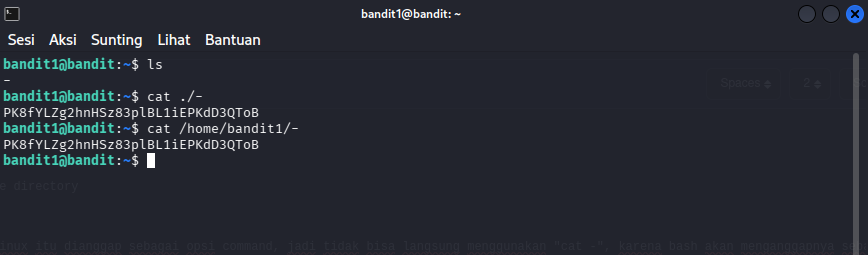

# OverTheWire : Level 1 - 2

## Objective
Mencari password untuk level berikutnya yang berada di file bernama "-" di home directory

## Purpose
Mempelajari dan menggunakan command "ls","cat". Selain itu tanda "-" di kali linux itu dianggap sebagai opsi command, jadi tidak bisa langsung menggunakan "cat -", karena bash akan menganggapnya sebagai opsi

## Solution
```bash
# Login Sebagai bandit1
ssh bandit1@bandit.labs.overthewire.org -p 2220
```
```bash
# Melihat Isi Directory
ls
```
```bash
# Menggunakan Full Path
cat /home/bandit1/-

# Menggunakan Relative Path
cat ./-
```


**Penjelasan** : Dengan menambahkan ./ sebelum nama file membuat bash memahami bahwa "-" nama file, bukan opsi command
**Password** : PK8fYLZg2hnHSz83plBL1iEPKdD3QToB

## Conclusion
Dilevel ini kita mencari password level berikutnya dengan membuka file "-" di home directory. Kendalanya adalah dalam bash "-" itu dianggap sebagai opsi, bukan sebagai nama file
