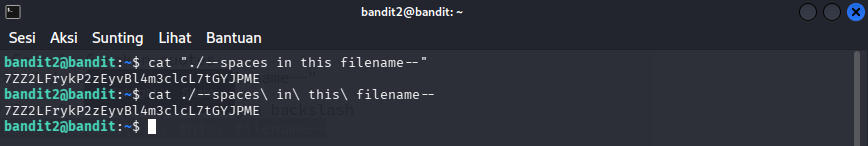

# OverTheWire : Level 2 - 3 

## Objective 
Mencari password level berikutnya di dalam file yang bernama "spaces in this filename" di home directory

## Purpose
Mencari password di dalam file bernama "spaces in this filename". Namun kendalanya adalah nama file tersebut mengandung spasi, jadi tidak bisa ditangani dengan command biasa

## Solution
```bash
# Login sebagai bandit2
ssh bandit2@bandit.labs.overthewire.org -p 2220
```

```bash
# Cara 1: Gunakan quotes
cat "./--spaces in this filename--"

# Cara 2: Escape spasi dengan backslash
cat ./--spaces\ in\ this\ filename--

# Cara 3: Tab completion (tekan TAB setelah mengetik 'sp')
cat sp[TAB]
```


## Conclusion
Di level ini kita diminta untuk mencari password untuk level berikutnya. Namun terdapat tantangan yaitu, password itu mengandung spasi, jadi tidak bisa ditangani dengan command biasa. Karena jika menggunakan command biasa, maka linux akan menganggapnya sebagai file yang terpisah
