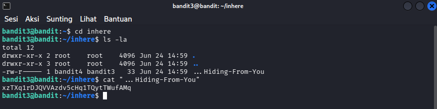

# OverTheWire : Level 3 - 4

## Objectives
Menemukan password untuk level berikutnya di dalam file tersembunyi di direktori "inhere".

## Purpose
mencari file tersembunyi di dalam direktori "inhere". File tersebut tersembunyi karena diawali dengan ".". Perintah "ls" tidak bisa menampilkannya

## Solution
```bash
# Login sebagai bandit3
ssh bandit3@bandit.labs.overthewire.org -p 2220
```

```bash
# Masuk ke direktori inhere
cd inhere

# Tampilkan semua file termasuk hidden
ls -la

# Baca hidden file (nama file ...Hiding-From-You)
cat "...Hiding-From-You"
```



**Penjelasan :** -a artinya "all", yaitu agar sistem menampilkan seluruh isi direktori yang ada ataupun yang disembunyikan

**Password :** xzTXq1rDJQVVAzdv5cHq1TQytTWufAMq

## Conclusion
Di level ini kita diminta untuk menemukan password di dalam file tersembunyi
