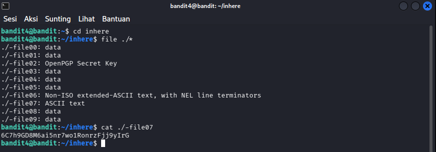

# OverTheWire : Level 4 - 5

## Objectives
Mencari password untuk level berikutnya di dalam satu-satunya file human-readable atau yang dapat dibaca manusia di dalam folder yang bernama "inhere".

## Purpose
Memahami dan menggunakan command "file" untuk mengetahui type file tersebut.

## Solutions
```bash
# Login sebagai bandit4
ssh bandit4@bandit.labs.overthewire.org -p 2220
```

```bash
# Masuk ke direktori inhere
cd inhere

# Cek tipe semua file
file ./*# Cari file yang bertipe ASCII text (human-readable)

# Biasanya -file07 yang bertipe ASCII
cat ./-file07
```



**Penjelasan :** Command "file" berfungsi untuk mengecek type isi file tersebut

**Password :** 6C7h9GD8M6ai5nr7wo1RonrzFjj9yIrG

## Conclusion
Di level ini kita mencari password di dalam satu - satunya file yang dapat dibaca oleh manusia/human-readable. Disini kita dapat mempelajari cara melihat tipe - tipe file yang kita temui di kali linux.
